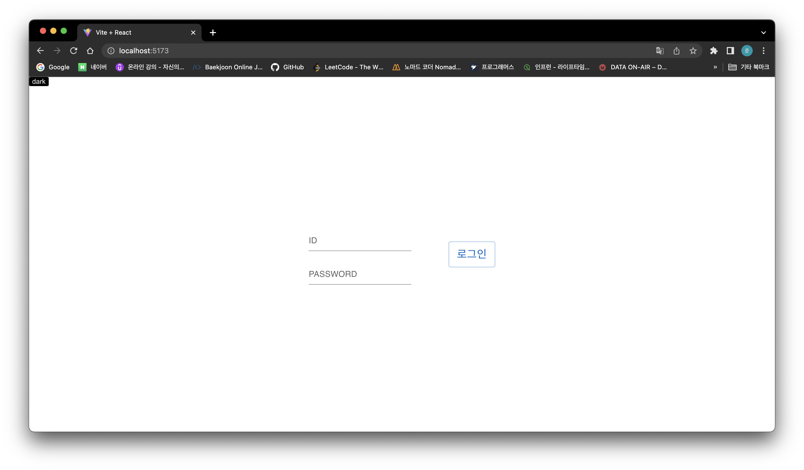

# 42gg 프론트엔드 온보딩 2단계

## 공통 조건

- 온보딩 프로젝트는 개인 계정으로 fork하여 진행하고 PR로 제출합니다.
- git / github / code 컨벤션은 42gg notion에 있는 자료를 적극 반영합니다.
- 기본 기능 외 추가 기능, 디자인 구현은 자유입니다.
- 최종 제출품에는 README 작성이 되있어야 합니다.([예시](https://github.com/42organization/42gg.client/blob/main/README.md))

## EX01. login / logout 구현하기

- (필수) React.js, Recoil, SCSS
- (필수) eslint, prettier 설정
- (필수) 함수 컴포넌트로 제작
- (선택) CRA, Webpack, Vite
- (선택) msw, react-query / SWR
- (선택) Figma, MUI, Ant Design, Tailwind CSS
- (선택) 계정 유효성 검사

## EX02. 유저 권한별 routing page

- (중요) EX01 결과물에 이어서 작업합니다.
- (필수) normal, manager, admin 3개의 권한을 가진 유저별 정보 제공
- (필수) 권한별 routing page 구현
- (필수) 상단 navbar, sidebar 제작
- (선택) React-Router-Dom v6, Context API
- (선택) 로그인 유지
- (선택) custom hook

## 참고

- 유저 정보는 json-server or js 파일 내 객체를 이용하여 관리합니다.
- 로그인/로그아웃 구현하기 위해 필요한 기능과 화면 구성들을 생각(그려보고)해보고, 구현해보세요.
- 궁금한 사항은 issue에 등록해주세요.

## 구현

### 로그인 페이지

- 화면 중앙 로그인 폼
- 화면 좌측 상단 다크모드로 테마 바꾸는 버튼

### 로그인 폼

- 아이디와 비밀번호 적는 input
- 로그인 버튼
- 로그인 버튼 누르지 않고 아이디 비밀번호만 채운 뒤 엔터키로도 작동

### 로그인 폼 경고

- 아이디나 비밀번호 작성을 하지 않고 엔터나 로그인 버튼 누를 시 경고
- 둘 다 비어있을 경우에는 아이디 경고
- 존재하지 않는 회원일 경우 경고

### 다크모드 테마 변경 버튼

- 다크 버튼 클릭 시 라이트 버튼으로 바뀌며 화면 테마 변경됨
- 라이트 버튼 클릭 시 다크 버튼으로 바뀌며 화면 테마 변경됨

### 유저 페이지

- 유저 권한마다 보이는 상단바 메뉴가 다름(사진은 위에서부터 순서대로 노말, 매니저, 관리자)
- 상단바와 사이드바 로그아웃 버튼
- 사이드바는 기본 숨김처리, 버튼 누르면 보이는 형식

### 상단바

- 클릭 시 연결된 페이지로 이동

### 사이드바

- 사이드 버튼 클릭시 사이드 메뉴 왼쪽에서 나타남
- 다시 버튼 누르면 사이드 메뉴 사라짐

### 없는 페이지 경로 접근

- 없는 페이지에 url로 접근 시 나타나는 페이지

### 로그인 권한 없는 페이지 접근 경고

- 로그인하지 않았거나 유저 본인의 권한 외의 페이지 접근 시 발생하는 경고

### 로그인한 유저가 로그인페이지 접근 경고

- 로그인 상태의 유저가 로그인 페이지 시도할 때 뜨는 경고 

